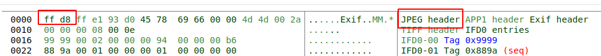
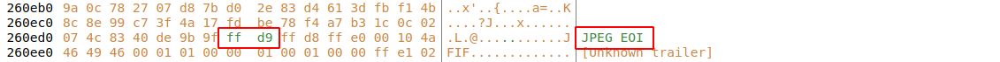
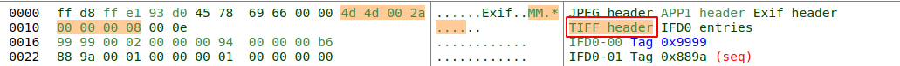
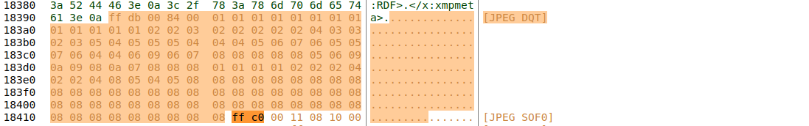
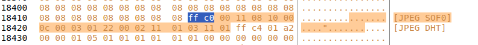
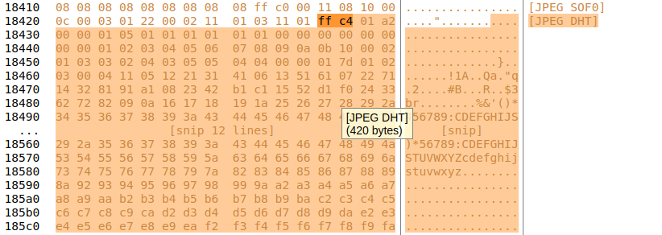
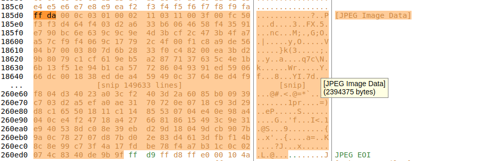
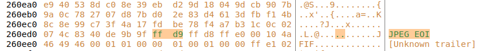

## 1. JPEG如何保存

JPEG图片格式组成为：

粗体为JPEG组成中的必须部分。

| 名称     | 标记码 | 含义             |
| :------- | :----- | :--------------- |
| **SOI**  |        | 文件头           |
| **APP0** |        | 图像识别信息     |
| **DQT**  |        | 定义量化表       |
| **SOF0** |        | 图像基本信息     |
| **DHT**  |        | 定义Huffman表    |
| DRI      |        | 定义重新开始间隔 |
| **SOS**  |        | 扫描行开始       |
| **EOI**  |        | 文件尾           |

### 1.1 Android如何识别JPEG文件？

原理非常简单，通过判断jpeg二进制文件的前3个字节是否是以**FF D8 FF**开始，如果是就认为它是JPEG图。

### 1.2 JPEG文件的段结构

JPEG文件以段的形式来存储信息，段的多少和长度不固定。JPEG的每个段一定都包含四个部分：**段标识**、**段类型**、**段长度**以及**段内容**。段标识的标记码为一个字节长度的十六进制数0xFF，段类型也是一个字节长度的十六进制数，对于不同的段，它的值也不同。

紧接着两个字节存放段长度（==这个长度包含段内容和段长度本身，不包括段标识和段类型这两个字节长度==）。

注意：这个长度的表示方法是按照高位在前，低位在后的（Motorola格式），与 Intel 的表示方法不同。比方说一个段的长度是0x12AB，那么它会按照0x12，0xAB的顺序存储。但是如果按照Intel的方式：高位在后，低位在前的方式会存储成0xAB，0x12，而这样的存储方法对于JPEG是不对的。这样的话如果一个程序不认识JPEG文件某个段，它就可以读取后两个字节，得到这个段的长度，并跳过忽略它。

| 名称   | 字节数 | 标识码 | 说明                   |
| ------ | ------ | ------ | ---------------------- |
| 段标识 | 1      | 0xFF   | 每个新段的开始标识     |
| 段类型 | 1      | 0xXX   | 类型编码，也成为标记码 |
| 段长度 | 2      | 0xXXXX | 包括段内容和段长度本身 |
| 段内容 |        |        | <= 65533 Byte          |

值得注意的是：

* JPEG格式中所有关于宽度、高度、长度间隔这一类数据，凡是 > 1字节，均采用Motorola格式，即高位在前、低位在后。
* 有些段没有长度描述，只有段标识和段内容
* 段段之间无论有多少FF都是合法的，这些FF称为“填充字节”。

> 参考: <https://blog.csdn.net/huabiaochen/article/details/108044123>

### 1.3 段类型

段类型有30种，但只有10种是必须被所有程度识别的，其他的类型可以忽略。

| 名称 | 标识码 | 说明                       |
| ---- | ------ | -------------------------- |
| SOI  | D8     | 文件头                     |
| EOI  | D9     | 文件尾                     |
| SOF0 | C0     | 帧开始                     |
| SOF1 | C1     | 同上，帧开始               |
| DHF  | C4     | 定义Huffman表              |
| SOS  | DA     | 扫描行开始                 |
| DQT  | DB     | 定义量化表                 |
| DRI  | DD     | 定义重新开始间隔           |
| APP0 | E0     | 定义交换格式和图像识别信息 |
| COM  | FE     | 注释                       |

#### 1.3.1 文件头和文件尾

JPEG文件开头2个字节都是 FF D8，这是JPEG协议规定的，文件尾为 FF D9s

文件头：

文件尾：

#### 1.3.2 APP0图形识别信息

APP0图像识别信息

| 名称           | 字节数 | 值         | 说明                                           |
| -------------- | ------ | ---------- | ---------------------------------------------- |
| 段标识         | 1      | FF         | /                                              |
| 段类型         | 1      | E0         | /                                              |
| 段长度         | 2      | 0x0010     | 如果有RGB缩略图长度=16+3n                      |
| 以下为段内容： |        |            |                                                |
| 交换格式       | 5      | 4A46494600 | “JFIF”的ASCII码                                |
| 主版本号       | 1      |            |                                                |
| 次版本号       | 1      |            |                                                |
| 密度单位       | 1      | 0/1/2      | 0=无单位；1=点数/英寸；2=点数/厘米             |
| X像素密度      | 2      |            | 水平方向的密度                                 |
| Y像素密度      | 2      |            | 垂直方向的密度                                 |
| 缩略图X像素    | 1      |            | 缩略图水平像素数目                             |
| 缩略图Y像素    | 1      |            | 缩略图垂直像素数目                             |
| RGB缩略图      | 3 x n  |            | n = 缩略图像素总数 = 缩略图X像素 x 缩略图Y像素 |

说明：

* JFIF是JPEG File Interchange Format的缩写，即JPEG文件交换格式，另外还有==TIFF==等格式，小米相机照片采用。

  

* “如果有RGB缩略图就＝16＋3n”是什么意思呢？比如说“缩略图X像素”和“缩略图Y像素”的值均为48，就表示有一个48×48像素的缩略图（ｎ＝48×48），缩略图是24位真彩位图，用３个字节来表示一个像素，所以共占用3n个字节。

#### 1.3.3 DQT定义量化表

| 名称         | 字节数 | 值     | 说明                                                 |
| ------------ | ------ | ------ | ---------------------------------------------------- |
| 段标识       | 1      | FF     | /                                                    |
| 段类型       | 1      | DB     | /                                                    |
| 段长度       | 2      | 0x0084 | 其值 = 3 + n （3 = 段长度本身所占内存 + QT信息内容） |
| 以下为段内容 |        |        |                                                      |
| QT信息       | 1      | 0x00   | 0~3位: QT号，4~7位: QT精度（==0？8bit：16bit）       |
| QT           | n      |        | n = 64 x QT精度的字节数                              |

说明：

* JPEG文件一般有2个DQT段，为Y值（亮度）一个，为C值（色度）一个。
* 一个DQT段可以包含多个QT，每个都有自己的信息字节。

#### 1.3.4 SOF0 图像基本信息

| 名称                      | 字节数 | 值   | 说明                                      |
| ------------------------- | ------ | ---- | ----------------------------------------- |
| 段标识                    | 1      | FF   |                                           |
| 段类型                    | 1      | C0   |                                           |
| 段长度                    | 2      |      | 其值=8+组件数量 x 3                       |
| 以下为段内容：            |        |      |                                           |
| 样本精度                  | 1      | 8    | 每个样本位数                              |
| 图片高度                  | 2      |      |                                           |
| 图片宽度                  | 2      |      |                                           |
| 组件数量                  | 1      | 3    | 1=灰度图，3=YCbCr/YIQ彩色图，4=CMYK彩色图 |
| 以下每个组件占用3个字节： |        |      |                                           |
| 组件ID                    | 1      |      | 1=Y，2=Cb，3=Cr，4=I，5=Q                 |
| 采样系数                  | 1      |      | 0-3位：垂直采样系数，4-7位：水平采用系数  |
| 量化表号                  | 1      |      |                                           |

说明：

* 组件数量可以理解为jpeg图的颜色通道数，JPEG大都采用YCrCb色彩模型，所以组件数量一般为3。一个样本就是一个组件
* 采样系数是实际采样方式与最高采样系数之比，而最高采样系数一般为0.5，如果垂直采用系数是2，那么实际采样方式为 0.5 x 2 = 1，也就是每个点采一个样（逐点采样）；如果垂直采样系数为1，那么 0.5 x 1 = 0.5，表示每2个点采一个样。

如图 SOF0 表示的基本信息为：

* 段长度：2个字节，0x0011 ===> 17 = 8 + 3x3，说明组件数量有3个。

* 样本精度：1个字节，0x08，每个样本的信息是8bit。

* 图片高度：2个字节，0x1000，4096，与实际高度一致。

* 图片宽度：2个字节，0x0C00，3072，与实际宽度一致。

* 组件数量：1个字节，0x03，代表YCbCr彩色图，有3个组件分别为Y、Cb、Cr。

* 每个组件占用3个字节，第1个字节是组件ID，第2个字节是采样系数，第3个字节是量化表号。

  * 01 22 00 ===> Y组件，垂直采样系数和水平采样系数都是2，量化表号为0。
  * 02 11 01 ===> Cb组件，垂直采样系数和水平采样系数都是1，量化表号为1。
  * 03 11 01 ===> Cr组件，垂直采样系数和水平采样系数都是1，量化表号为1。

  可以看出，Y采用是逐点采样，CbCr是隔点采样，这就是标准的YUV422数据。

#### 1.3.5 DHT 定义Huffman表

| 名称           | 字节数 | 值   | 说明                                               |
| -------------- | ------ | ---- | -------------------------------------------------- |
| 段标识         | 1      | FF   |                                                    |
| 段类型         | 1      | C4   |                                                    |
| 段长度         | 2      |      | 其值 = 19 + n（一个HT表）                          |
| 以下为段内容： |        |      |                                                    |
| HT信息         | 1      |      | 0～3位：HT号，4位：HT类型，0=DC表 1=AC表，5-7位：0 |
| HT位表         | 16     |      | 这16个数的和应该 <= 256                            |
| HT值表         | n      |      | n = 表头16个数的和                                 |

说明：

* JPEG文件里有２类Haffman 表：一类用于DC（直流量），一类用于AC（交流量）。一般有４个表：亮度的DC和AC，色度的DC和AC。最多可有６个。

* 一个DHT 段可以包含多个HT表, 每个都有自己的信息字节

* HT表是一个按递增次序代码长度排列的符号表。

详细略。

#### 1.3.6 SOS 扫描行开始

| 名称             | 字节数 | 值     | 说明                                             |
| ---------------- | ------ | ------ | ------------------------------------------------ |
| 段标识           | 1      | FF     |                                                  |
| 段类型           | 1      | DA     |                                                  |
| 段长度           | 2      | 0x000C | 其值 = 6 + 2 x 扫描行内组件数量                  |
| 以下为段内容：   |        |        |                                                  |
| 扫描行内组件数量 | 1      | 3      | 必须>=1，<=4，通常为3                            |
| 组件ID           | 1      |        | 1=Y，2=Cb，3=Cr，4=I，5=Q                        |
| Huffman表号      | 1      |        | 0~3位：AC表号，值为0..3，4~7位：DC表号，值为0..3 |
| 剩余3个字节      | 3      |        | 忽略                                             |

说明：

* 紧接着SOS段后的是压缩的图像数据（一个一个扫描行）,数据存放顺序是从左到右，从上到下。

SOS扫描行开始：

* 段标识+段类型：2个字节，0xFFDA

* 段长度：2个字节，0x000C ===> 12 = 6 （2个字节段长度 + 1个字节扫描行组件数量 + 3个字节剩余位）+ 2x3（(1个字节组件ID + 1个字节Huffman表号) x 扫描行内组件数量）

* 扫描行内组件数量：1个字节，0x03 ===> 代表组件数量为3

  * 每个组件占用2个字节：

  * 第一个字节是组件ID(1 = Y, 2 = Cb, 3 = Cr, 4 = I, 5 = Q)；第二个字节0-3位AC表号，4-7位DC表号。表号的值是0-3。

    * 01 00 => Y组件，AC表号是0，DC表号是0

    * 02 11 => Cb组件，AC表号是1，DC表号是1

    * 03 11 => Cr组件，AC表号是1，DC表号是1

>  此处跟DHT（定义Huffman表）的HT信息是一致的。

#### 1.3.7 EOI文件尾

| 名称   | 字节数 | 值   |
| ------ | ------ | ---- |
| 段标识 | 1      | FF   |
| 段类型 | 1      | D9   |

说明：

* 这2个字节构成了JPEG文件尾

### 1.4 JPEG中的Exif数据

#### 1.4.1 什么是Exif

Exif的全称是Exchangeable Image File（可交换图像文件）的缩写，是专门为数码相机照片设计的，用来记录拍摄图像时的各种信息，这些信息将**按照JPEG/EXIF文件标准**放在图像文件头部。

> 严谨的说，JPEG是一种编解码标准不是一种文件格式，其对应的文件格式有JIF，JPEG/JFIF，JPEG/EXIF等

Exif记录的信息主要分为一下几类：

* 拍摄信息：小米相机会记录拍照软件通路中的处理中间状态，方便研发debug。
* 拍摄参数：快门速度、光圈F值、ISO速度、焦距等
* 图像处理参数：锐化、对比度、饱和度、白平衡等
* 图像描述及版权信息
* 缩略图
* GPS定位数据

Exif是元数据（Metadata）的一种，所谓元数据是描述数据的数据，主要是描述数据属性的信息。目前常见的元数据有Exif、XMP和IPTC三种：

* Exif：通常被数码相机在拍照拍摄照片时自动添加。
* IPTF：主要是由人工在后期通过软件写入，比如图片标题、关键字、说明、作者、版权等信息。
* XMP：XMP实际是一种元数据存储和管理的标准，可以将Exif、IPTC或者其他数据都按照XMP统一的格式存放在图像文件中。原因是，将JEPG格式转换为其他格式的格式文件如PNG时，这些格式都不支持Exif格式，所以Exif信息会丢失，为了解决这个问题，Adobe公司推出用XMP管理元数据的方法，即将图像中的元数据Exif、IPTC等都纳入XMP库中，由XMP管理。

#### 1.4.2 Exif文件格式说明

